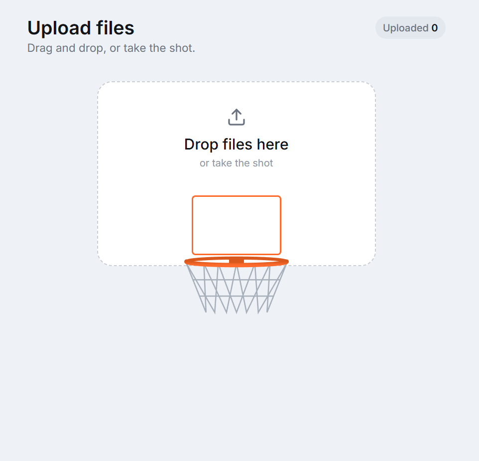

# Animated Drag & Drop File Uploader

An incredibly fun, highly interactive file uploader component built with **React**, **Next.js (App Router)**, and **Tailwind CSS**. Drag and drop your files to "take a shot" and watch them fly, bounce off the rim, and swish through the net!


Live Demo: https://animated-drag-and-drop.vercel.app/

---




## ✨ Features

* **Physics-Like Animation:** Smooth quadratic Bezier curve trajectory on drag and release.
* **Rim Collision & Bounce:** Files realistically strike the rim, trigger a hoop shake, bounce upward, and then fall cleanly through the net.
* **3D Hoop Layering:** Clever CSS Z-indexing ensures the file drops *behind* the net but *in front* of the back rim.

---

## 🚀 Quick Start

### 1. Clone the repository
```bash
git clone https://github.com/your-username/Animated-Drag-and-drop.git
cd Animated-Drag-and-drop
